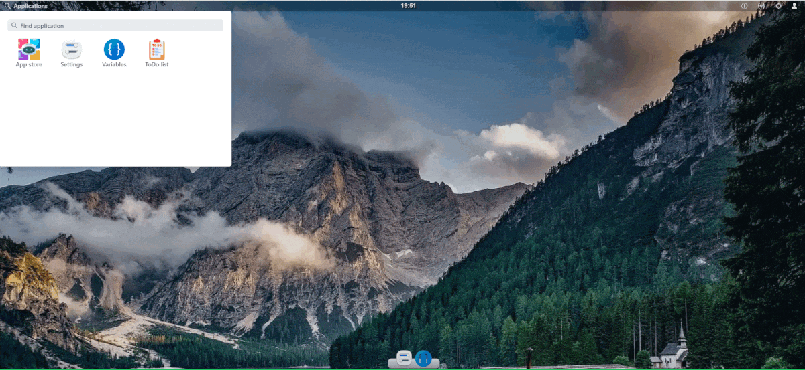

# Skeleton app
- This project is a skeleton for the module/application that will be run inside the pacos system
- Provides example for setting page and module window
- The pacos uses vaadin 24 framework for the frontend and spring boot 3.0.0 framework for the backend

### skeleton module demo

##  Spring configuration
- Spring is configured to scan all classes inside package `org.pacos.plugin.<your.module.name>.config`

## HotSwap
https://vaadin.com/docs/latest/configuration/live-reload/hotswap-agent

## Run
- Mark 'Add dependencies with provided scope to classpath' - this is important step.
- Run main from class `org.pacos.plugin.skeleton.Skeleton.class`. This will build pacos system with skeleton project
  inside (as a part of the pacos system)
- The first run will trigger default installation mode. After configuration go directly to main desktop page
  `http://localhost:8086/desktop`
- To change default location of pacos home, add VM arg `-DworkingDir=/path/to/dir`

## Project structure
package description:

- `org.pacos.plugin.skeleton` - primary package with all sources for this component
- `org.pacos.plugin.skeleton.config` - this package is read by spring from the core module. Contains spring and
  database configuration
- `org.pacos.plugin.skeleton.backend` - contains all class that defines backend
- `org.pacos.plugin.skeleton.security` - contains permission definition witch is loaded and managed by core
- `org.pacos.plugin.skeleton.system` - contains classes responsible for module behavior like events or listeners
- `org.pacos.plugin.skeleton.view` - contains classes that creates frontend view

- all static resources used by fronted (like imagse,script,css) should be placed inside `META-INF/resources` directory.
  All resources from this directory will be made available by the Pacos as static web elements

## Database
- Each pacos system module has an independent database configuration. The core uses hsqldb as default, so this driver is included in maven bom

## Api
- Skeleton has configured logic to automatically generate API documentation during integration-test phase.
- Documentation from all plugins is aggregated by Pacos and available at the default address /swagger-ui/index.html
- Documentation file is created by integration-test and placed under physical file located under classes/v3/api-doc.json
  during build

## Useful links
- Vaadin components https://vaadin.com/docs/latest/components
- Documentation https://pacos.dev

## Packaging
To create jar that will be imported to the existing pacos instance, run `mvn clean package`.
This will generate a shade-jar with all additional dependencies required by this module.
Shade jar can be imported to the existing pacos instance from the UI or from the configured maven repo